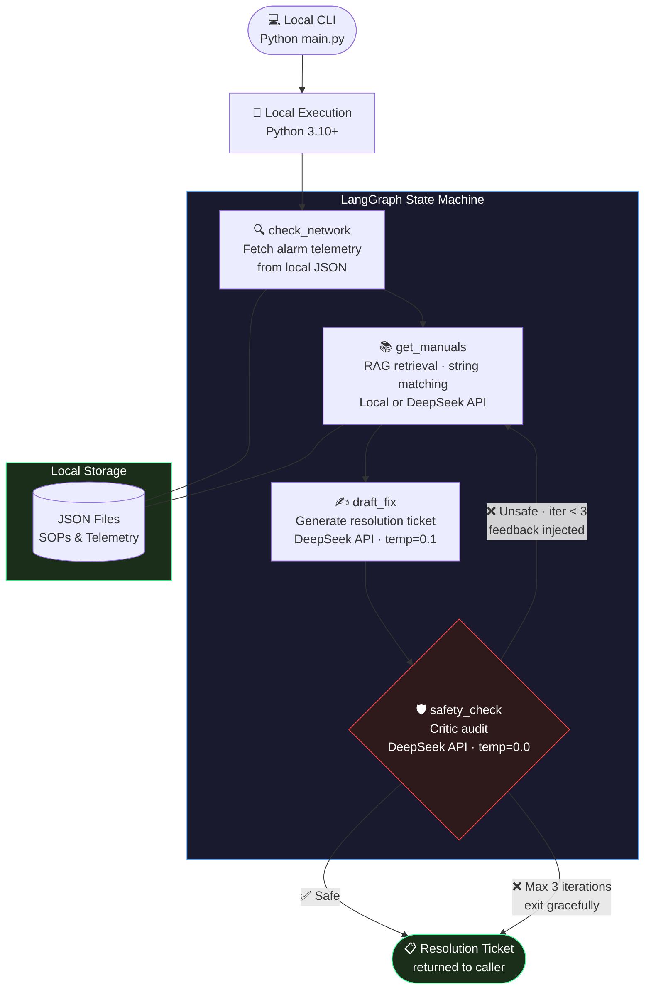

# Autonomous Telecom NOC Resolution Agent

<div align="center">

| ⚡ Resolution Time | 🔁 Self-Correction | 🧪 Test Coverage | 🚀 Deployment |
|:---:|:---:|:---:|:---:|
| 45–90 min → **<60s** | Up to **3 retries** | **70%** covered | Local Development · AWS Ready |

</div>

An enterprise-grade Agentic RAG system built with **LangGraph**, **DeepSeek API**, and **Local JSON Storage** that autonomously investigates network alarms, retrieves vendor SOPs, drafts incident resolution tickets, and self-evaluates for safety compliance — designed for both local development and AWS Lambda deployment.

---

## Quick Start

### Prerequisites
- Python 3.10+
- DeepSeek API key
- Virtual environment (recommended)

### Step 1: Clone the repository
```bash
git clone <your-repository-url>
cd telecom-noc-agent
```

### Step 2: Set up environment
```bash
# Create virtual environment
python -m venv venv
# Activate virtual environment
venv\Scripts\activate  # Windows
# or: source venv/bin/activate  # macOS/Linux

# Install dependencies
pip install -r requirements.txt
```

### Step 3: Configure environment variables
```bash
cp .env.example .env
# Edit .env file and add your DEEPSEEK_API_KEY
```

### Step 4: Run the agent
```bash
python main.py                     # ALARM-001 (default)
python main.py --alarm ALARM-002   # Nokia GPON ONU Rx Low
python main.py --alarm ALARM-003   # Cisco ASR9001 BGP Flap
python main.py --alarm ALARM-004   # Juniper MX480 Congestion
```

---

## Business Value

In modern Telecom Network Operations Centers, L3 engineers spend an average of **45–90 minutes per critical alarm** manually:
1. Correlating live telemetry from NMS dashboards
2. Searching through hundreds of pages of vendor manuals
3. Drafting step-by-step resolution procedures
4. Getting peer review for safety compliance

This agent compresses that entire workflow to **under 60 seconds**, with built-in SOP compliance enforcement — reducing Mean Time to Resolution (MTTR), minimizing human error, and freeing senior engineers for complex escalations.

---

## 🏗️ Architecture

The agent runs as a **4-node LangGraph state machine** that resolves NOC alarms in under 60 seconds with a built-in self-correction loop. It can be run locally or deployed to AWS Lambda.



> ⚡ **Mean time to resolution: 45–90 min → under 60 seconds**

---

## Local Architecture

### How it works

1. **Local CLI** runs `python main.py` with an optional `--alarm` parameter.
2. **LangGraph State Machine** executes the 4-node workflow:
   - **Node 1** (`check_network`): Loads alarm telemetry from local JSON files.
   - **Node 2** (`get_manuals`): Retrieves relevant SOPs using string matching or embeddings.
   - **Node 3** (`draft_fix`): Uses DeepSeek API to generate a resolution ticket.
   - **Node 4** (`safety_check`): Uses DeepSeek API to audit the ticket for SOP compliance.
3. **Self-correction loop**: If the ticket fails the audit, the agent loops back to Node 2 with feedback — up to 3 iterations.
4. **Final output**: The approved ticket (or flagged ticket with safety concerns) is returned to the user.

### Self-Correction Loop

```
START → check_network → get_manuals → draft_fix → safety_check
                              ▲                          │
                              │    (is_safe=False,       │
                              └─── iterations < 3)  ◄───┘
                                                         │
                                                    (is_safe=True
                                                    OR iterations ≥ 3)
                                                         │
                                                        END
```

---

## 💼 Why This Matters
NOC engineers manually spend 45–90 minutes per incident searching vendor
documentation and drafting resolution tickets. This agent is designed to
compress that entire workflow to under 60 seconds by combining semantic
SOP retrieval with a self-auditing critic loop — reducing human error in
high-pressure network operations environments.

---

## Tech Stack

| Layer | Technology | Notes |
|-------|-----------|-------|
| **Orchestration** | LangGraph ≥0.2.0 | StateGraph with conditional routing |
| **LLM** | DeepSeek API via LangChain | Brain (temp=0.1) + Critic (temp=0.0) |
| **Embeddings** | Local (all-MiniLM-L6-v2) | Optional; falls back to string matching |
| **RAG / Vector Search** | Local JSON + string matching | Simple and lightweight |
| **Data Store** | Local JSON files | `data/sops.json` and `data/mock_telemetry.json` |
| **Compute** | Local Python | Tested with Python 3.10+ |
| **Validation** | Pydantic v2 | `SafetyAuditResult` enforces boolean `is_safe` + feedback |
| **Runtime** | Python 3.10+ | Virtual environment recommended |
| **Testing** | pytest | Unit tests for core functionality |
| **Linting / Formatting** | Ruff + mypy | Enforced via pre-commit hooks |

---

## Project Structure

```
telecom-noc-agent/
├── src/
│   ├── state.py               # NOCAgentState TypedDict — single source of truth
│   ├── tools.py               # @tool: query_nms_for_alarm_telemetry
│   ├── retriever.py           # DynamoDB SOP loader + numpy cosine similarity RAG
│   ├── nodes.py               # 4 LangGraph node functions
│   └── graph.py               # StateGraph compilation + conditional routing
├── tests/
│   ├── conftest.py            # Shared fixtures: moto DynamoDB, mock OpenAI, sample data
│   ├── test_state.py          # NOCAgentState schema validation
│   ├── test_retriever.py      # RAG: DynamoDB load + cosine similarity
│   ├── test_nodes.py          # Node unit tests (check_network, draft_fix, safety_check)
│   └── test_lambda_handler.py # Lambda handler integration tests
├── data/
│   ├── sops.json              # Source of truth for 5 SOP documents (seeds DynamoDB)
│   ├── mock_telemetry.json    # Source of truth for 4 alarm scenarios (seeds DynamoDB)
│   └── mock_telemetry.py      # DynamoDB telemetry loader with module-level cache
├── scripts/
│   └── seed_dynamodb.py       # One-time script: creates DynamoDB tables + uploads data
├── .github/
│   └── workflows/ci.yml       # CI pipeline: lint → test → docker build
├── lambda_handler.py          # AWS Lambda entry point (graph built per invocation; CORS + 400/500 handling)
├── Dockerfile                 # Lambda container — public.ecr.aws/lambda/python:3.12
├── pyproject.toml             # pytest, ruff, mypy, and coverage configuration
├── .pre-commit-config.yaml    # Pre-commit: ruff, mypy, detect-secrets, JSON/YAML checks
├── main.py                    # CLI entry point (local dev)
├── requirements.txt           # Python dependencies (boto3, numpy, langgraph, openai...)
└── .env.example               # Environment variable template
```

---

## Component Overview

| Component | File | Responsibility |
|-----------|------|---------------|
| State Schema | `src/state.py` | `NOCAgentState` TypedDict + `SafetyAuditResult` Pydantic model |
| NMS Tool | `src/tools.py` | LangChain `@tool` wrapper (used by `main.py`; nodes use boto3 directly) |
| RAG Engine | `src/retriever.py` | DynamoDB scan + numpy cosine similarity; `retrieve_relevant_sops()` is primary API |
| Node 1 | `src/nodes.py:check_network` | Fetches live device telemetry via boto3 directly |
| Node 2 | `src/nodes.py:get_manuals` | Semantic SOP retrieval; enriches query with safety feedback on retry |
| Node 3 | `src/nodes.py:draft_fix` | GPT-4o resolution ticket drafting |
| Node 4 | `src/nodes.py:safety_check` | GPT-4o critic with structured Pydantic output; increments `iterations` on failure |
| Graph | `src/graph.py` | LangGraph compilation + `MAX_ITERATIONS=3` routing |
| Lambda Handler | `lambda_handler.py` | API Gateway body parsing, `alarm_id` validation (400), CORS headers, 500 on error |
| CLI Runner | `main.py` | Local development with 4 pre-built alarm scenarios |

---

## Embedded SOPs (DynamoDB Contents)

Five realistic SOP documents are stored in the `telecom-noc-sops` DynamoDB table, embedded on Lambda cold start, and retrieved by cosine similarity at query time:

| SOP ID | Title | Source |
|--------|-------|--------|
| SOP-001 | Arris E6000 CMTS — DOCSIS T3 Timeout Remediation | Arris E6000 Guide v4.2 |
| SOP-002 | Nokia 7360 ISAM FX — GPON ONU Rx Power Low | Nokia 7360 Manual Rev 3.1 |
| SOP-003 | BGP Session Flap — Core Router Runbook | Internal NOC Runbook v2.8 |
| SOP-004 | Interface Queue Congestion — QoS Runbook | Internal NOC Runbook v2.8 |
| SOP-005 | NOC Escalation and Communication Protocol | NOC Operations Policy v5.0 |

---

## Testing & Code Quality

### Running tests
```bash
pytest                   # all tests, coverage enforced at 70%
pytest -m unit           # unit tests only (no external services)
pytest --no-cov -v       # quick run without coverage
```

Tests use **moto** to mock DynamoDB and `unittest.mock` for OpenAI — no real API calls or AWS credentials needed. Test markers: `unit`, `integration`, `slow`.

### Linting & formatting (Ruff)
```bash
ruff check --fix .       # lint and auto-fix
ruff format .            # format
mypy src/                # type check
```

### Pre-commit hooks
```bash
pre-commit install        # install hooks (one-time)
pre-commit run --all-files
```

Hooks run ruff, ruff-format, mypy, and security scanners (detect-secrets, detect-private-key) on every commit.

### CI Pipeline
GitHub Actions runs three jobs in sequence on every push:
1. **Lint & Type Check** — ruff + mypy
2. **Unit & Integration Tests** — pytest with coverage report (≥70%)
3. **Docker Build Check** — verifies the Lambda container builds successfully

---

## Local Development Setup

### Prerequisites
- Python 3.10+
- DeepSeek API key
- Virtual environment (recommended)

### Step 1: Clone and install
```bash
git clone <your-repository-url>
cd telecom-noc-agent
python -m venv venv
venv\Scripts\activate   # Windows
# or: source venv/bin/activate     # macOS / Linux
pip install -r requirements.txt
```

### Step 2: Configure environment
```bash
cp .env.example .env
# Edit .env — fill in DEEPSEEK_API_KEY
```

### Step 3: Run locally
```bash
python main.py                     # ALARM-001 (default)
python main.py --alarm ALARM-002   # Nokia GPON ONU Rx Low
python main.py --alarm ALARM-003   # Cisco ASR9001 BGP Flap
python main.py --alarm ALARM-004   # Juniper MX480 Congestion
```

---

## Docker / Lambda Deployment (Optional)

The agent can be deployed to AWS Lambda if needed. The project includes a `Dockerfile` and `lambda_handler.py` for this purpose.

```bash
# Build the Lambda container image (linux/amd64 — required for Lambda)
docker buildx build --platform linux/amd64 --provenance=false \
  -t <your-ecr-repository>:latest \
  --push .

# Update Lambda to pull the new image
aws lambda update-function-code \
  --function-name <your-lambda-function> \
  --image-uri <your-ecr-repository>:latest
```

> `--provenance=false` is required when building on Docker Desktop for Windows — without it, Docker
> pushes a multi-arch manifest list that AWS Lambda rejects.

---

## Push to GitHub

### Step 1: Create a new repository on GitHub
1. Go to GitHub and create a new repository
2. Copy the repository URL

### Step 2: Push your local repository
```bash
# Add the remote repository
git remote add origin <your-github-repository-url>

# Push to GitHub
git push -u origin master
```

### Step 3: Verify the push
Go to your GitHub repository to see the pushed code.

---

## Extending the Agent

### Add a new alarm scenario
1. Add an entry to `data/mock_telemetry.json`
2. Add the scenario to `ALARM_SCENARIOS` in `main.py`

### Connect to a real NMS
Replace the JSON loader in `data/mock_telemetry.py` with an API call:
```python
def get_telemetry_for_alarm(alarm_id: str) -> dict:
    response = requests.get(
        f"https://your-nms/api/alarms/{alarm_id}",
        headers={"Authorization": f"Bearer {os.getenv('NMS_API_KEY')}"}
    )
    return response.json()
```

### Load real SOP documents
1. Add entries to `data/sops.json` (or load from PDFs with `PyPDFLoader`)

### Add memory and persistence
```python
from langgraph.checkpoint.sqlite import SqliteSaver
memory = SqliteSaver.from_conn_string("noc_agent_memory.db")
graph = build_graph().compile(checkpointer=memory)
```

---

## License

This project is provided for educational and demonstration purposes.
For production use, ensure compliance with your organization's AI governance and change management policies.
